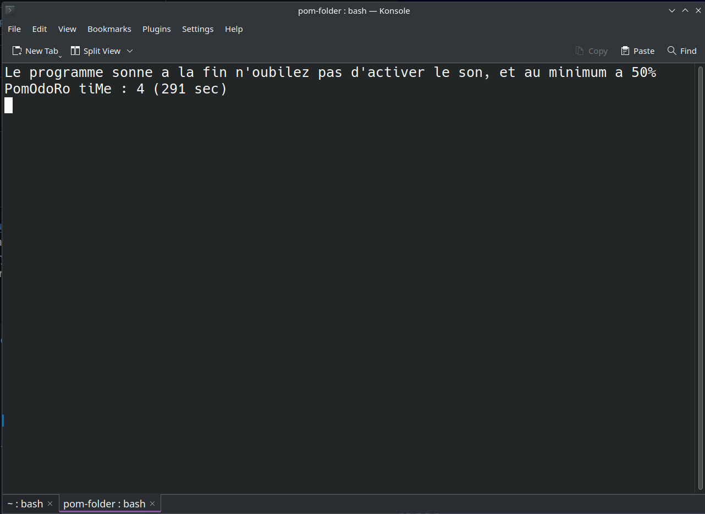

# pomodoro.sh
a super pomodoro app for linux.

# THE APP
[Source 📝](https://github.com/axiomcity/pomodoro.sh/blob/main/pomodoro.sh)

```bash

[[ ! $1 ]] && echo "Indiquer une durée : ./pomodoro.sh 5" && exit 0;
sec=$(($1*60));
ft_a ()

{
while [ $sec -gt 0 ]; do

        [[ $sec -le 3 ]] && ft_b;
        echo "Le programme sonne a la fin n'oubilez pas d'activer le son, et au minimum a 50%"
        echo "PomOdoRo tiMe : $min ($sec sec)";
        sec=$(($sec-1));
        min=$(($sec/60));
        sleep 1;
        clear;
done
}

ft_b () 

{
        for i in {1..3}
        do
          speaker-test -t sine -f 1000 -l 1 & sleep .2 && kill -9 $!;
          clear;
          sleep 1;
        done
        ft_c;
}

ft_c()

{
        clear
        echo "On dirai que c'est terminé mec";
        echo "Recommencer le truc la ?";
        read -p "Durée du pomodoro min : " rsec && sec=$(($rsec*60)) && ft_a
        return 0;
        exit 0;
}

ft_a;


```
